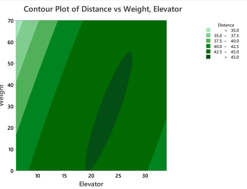

# 中期报告
## 1 实验方法&进度
### 1.1 实验方法
- 外置操作脚本（消除$\sigma_{operator}$？）
    - 后续通过脚本增加操作扰动
- contour plot

### 1.2 结果
当前最优的参数组合下，投掷距离为46.1m（要不要说这个啊？）

## 2 思路&具体步骤
### 2.1 因子筛选
>由于响应曲面设计在系统给定的变量维数下难以进行，因此考虑通过小规模实验确定具有较大影响的因子；并尝试对其中部分categorical因子进行定类

- 为什么是ANOVA？
    - 田口方法
    - 
- 进行两组析因实验
    - 2\*3\*3\*2试验
        - 
        - 
        - 
        - 
    - 改变取点的位置与步长，结果相同（才不会说那是因为懒）
    - （看因子图）有理由认为，将winlet固定为on能够稳定使飞行距离更大（或者做一下paired t-test，可以给出一个置信度；或者可以假装做了，因为因子图里默认状态不显示winglet，应该是超过95%置信度的）
    - 注意到typeA与B表现均相近，而C变化较大（包含于贡献出最大值的参数组合），所以选择typeB与C进行后续实验。

### 2.2 局部响应曲面
>对两个连续变量按一定步长采样，分别对B类与C类绘制contour plot，寻找可能包含最大值的区域，进行细化。

- 理由：对于物理模型的不了解，因此不排除起响应曲面非凸且非凹的可能性，采用类似模拟退火的思路。对响应整体较大的解空间进行更细致的采样，寻找局部最优解。
    - 更好的思路（后期尝试 ：神经网络）
    - 贝叶斯建模与优化
- typeB结果
    - 大概结构就是，先放整体的层级图，然后放细化的层级图，然后放响应曲面设计的结果
- typeC结果
    - 这部分主要是我做的，数据基本上都在 \[0926\]plane_type_c.mpx 这个文件里，前标3的是较大的范围，前标2的是较小的范围
    - 里面都有响应优化的结果
    - 存在的问题：响应曲面最上面tm是平的，也就是说，中间那一圈很平，没有啥坡度，导致相应优化器其实太能找到好的结果，优化出来只有45.9，但其实在深色区域最下面那里能找到超过46的组合

### 2.3 优化设计

- 目前采用的方法是固定投掷方法以简化实验（同样参数设置下每次投掷的结果都相同），但实际情况下难以做到。我们考虑对投掷过程引入二维正态分布以检验模型的鲁棒性。
- robust approximation
    - 目标函数很简单（只是distance）
    - 问题：操作扰动对模型系数带来的影响（即模型系数的分布是什么样的，如何写？）
      - 应该是在前面缩小后的范围上做（甚至在给定的最优参数组合上做），在固定参数组合的情况下，*对投掷施加随机扰动，观察模型系数的变化*？
    - 可以尝试不同的penalise函数，比如huber与经典的least square惩罚的对比
- 贝叶斯神经网络（BNN）(感觉就是鲁棒近似的进阶版，换了个名字)
    - BNN能对不确定性进行量化，并给出预测结果的置信度。而我们前期实验得到的linear/quadratic模型能够给出其参数的一个先验分布，在其基础上进行小规模的实验与训练，对预测鲁棒性能有所改进
    - 做个屁啊，参数的先验哪里来，难道要哥们去学飞机的动力学
- 敏感度分析
    - 因为我们把这个问题当成难以golbally optimize的问题，用的是搜索+逼近的思路，所以敏感度分析也用比较local的方法（目前想的就是各个参数方向的gradient哈哈哈哈哈）